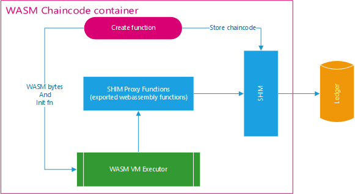

# Hyperledger Fabric WASM Chaincode

This project is focused on the integration layer that is required to enable execution of WebAssembly functions in Hyperledger Fabric Smart Contracts. The main piece of the integration will be the WASM chaincode (WASMCC), which will be compatible with the Hyperledger Go Chaincode.

 - **How wasm chaincodes are stored?**  
 WASMCC stores all new wasm chaincode as byte array in state against chaincode name
 - **How wasm chaincodes will interact with peer without a shim layer?**  
 WASM supports importing functions from host modules. So wascc exposes shim layer functions as wasm exported functions which can then in turn will be imported by wasm chaincode developers in their wasm chaincode
 - **How to instantiate or invoke wasm chaincode functions?**  
 Host modules can call wasm functions directly. Pass function name of wasm chaincode as argument in a transaction

How WASM Chaincodes are stored in hyperledger fabric by wasmcc:



How WASM Chaincides are invoked in hyperledger fabric by wasmcc:


# Table of contents

 - [Tutorial for WASM chaincode developers](#tutorial-for-wasm-chaincode-developers)
 	- [Exported functions from host(wasmcc) to wasm](#exported-functions-from-hostwasmcc-to-wasm)
 	- [Required functions to be implemented by every WASM Chaincode](#required-functions-to-be-implemented-by-every-wasm-chaincode)
 	- [WASMCC functions available to initiate transactions](#wasmcc-functions-available-to-initiate-transactions)
 - [Sample WASM Chaincode](#sample-wasm-chaincode)
 - [Deploy WASMCC on hyperledger fabric network](#deploy-wasmcc-on-hyperledger-fabric-network)
 - [End 2 End example with byfn using cli](#end-2-end-example-with-byfn)
 - [Tool: WASM pusher to install wasm chaincode](#wasm-pusher)
 - [How to run unit test](#run-unit-test)


## Tutorial for WASM chaincode developers


### Exported functions from host(wasmcc) to wasm

These are the exported functions available for WASM Chaincode Developers. Most of the functions are for interacting with SHIM layer, retrieving the transactions parameters etc.
- `__print` function, to print any statement .It accepts two parameters
    - parameter one: pointer to string
    - parameter two: length of string
    - returns 0
- `__get_state` function to retrieve objects from state. It accepts three parameters
    - parameter one: pointer to key
    - parameter two: length of key
    - parameter three: pointer to empty memory location where result of getState function will be stored
    - returns length of string stored at parameter three pointer
    - in case of error, returns -1
- `__put_state` function to store objects in state. It accepts four parameters
    - parameter one: pointer to key
    - parameter two: length of key
    - parameter three: pointer to value
    - parameter four: length of value
    - returns 0 if success, otherwise -1
- `__get_parameter` function to get transaction parameters. It accepts two parameter
    - parameter one: which transaction parameter to get, for example, to get first parameter, value of this will be one
    - parameter two: pointer to empty memory location where parameter value will be stored
    - returns length of parameter if success, otherwise -1
- `__delete_state` function to delete an object from state. It accepts two parameter
    - parameter one: pointer to key
    - parameter two: length of key
    - returns 0 if success, otherwise -1
- `__return_result` function is used to return a value as transaction response. It accepts two parameter
    - parameter one: pointer to string
    - parameter two: length of string
    - returns 0 if success, otherwise -1


### Required functions to be implemented by every WASM Chaincode

Every WebAssembly chaincode should implement `init` function.

### WASMCC functions available to initiate transactions


WASMCC have three functions available to initiate transaction from clients, namely, `create`, `execute` and `installedChaincodes` functions for a transaction
- `create` accepts wasm chaincode name, wasm chaincode in form of wasm binary or zip or hex value and the function parameters for init function of wasm chaincode
    - `create` invokes init function of wasm chaincode
    - `create` stores the chaincode in state on successful init invocation
- `execute` accepts wasm chaincode name, function to invoke and parameters(to be passed to wasm)
    - `execute` retrieves the wasm chaincode bytes from state and execute it in wasm vm
    - `execute` dynamically invokes the function from wasm chaincode whose name it accepted as a parameter initially. Also it will send number of transaction parameters available to wasm function
    - wasm chaincode can retrieves the parameter using exported `getParameters` function
    - wasm chaincode can returns the result and the result using `__return_result` function and. For success it should return 0 and for error it should return -1
- `installedChaincodes` give back all installed wasm chaincodes


## Sample WASM Chaincode
chaincode_example02 (Rust): [link](sample-wasm-chaincode/chaincode_example02/rust/src/lib.rs)


## Deploy WASMCC on hyperledger fabric network

This chaincode can be deployed like any other user chaincode to Hyperledger Fabric. The chaincode has no instantiation arguments.

When installing, point to the WASMCC [main package](wasmcc). Below is an example of installation and instantiation through the peer cli.
```
 peer chaincode install -n wasmcc -v 1.0 -p github.com/chaincode/wasmer-chaincode-test/wasmcc
 peer chaincode instantiate -n wasmcc -v 1.0 -C <channel-name> -c '{"Args":[]}' -o <orderer-address> --tls --cafile <orderer-ca>
```


## End 2 End example with byfn

wasmcc: [link](wasmcc)


**1. Tool to convert a file to string**:
Navigate to `tools/file-encoder`

Build it using `go build`

Invoke using: `./file-encoder`

Pass the absolute or relative path of your webassembly module/chaincode. For example, you can pass sample wasm in this repository: `sample-wasm-chaincode/chaincode_example02/rust/app_main.wasm`

The tool will copy the encoded chaincode to your clipboard and also display it over console.


**2. Install wasmcc chaincode:**
```
peer chaincode install -n wasmcc -v 1.0 -p github.com/chaincode/fabric-chaincode-wasm/wasmcc
```

and
```
CORE_PEER_MSPCONFIGPATH=/opt/gopath/src/github.com/hyperledger/fabric/peer/crypto/peerOrganizations/org2.example.com/users/Admin@org2.example.com/msp CORE_PEER_ADDRESS=peer0.org2.example.com:9051 CORE_PEER_LOCALMSPID="Org2MSP" CORE_PEER_TLS_ROOTCERT_FILE=/opt/gopath/src/github.com/hyperledger/fabric/peer/crypto/peerOrganizations/org2.example.com/peers/peer0.org2.example.com/tls/ca.crt peer chaincode install -n wasmcc -v 1.0 -p github.com/chaincode/fabric-chaincode-wasm/wasmcc
```

**3. Instantiate wasmcc chaincode:**
```
peer chaincode instantiate -o orderer.example.com:7050 --tls --cafile /opt/gopath/src/github.com/hyperledger/fabric/peer/crypto/ordererOrganizations/example.com/orderers/orderer.example.com/msp/tlscacerts/tlsca.example.com-cert.pem -C mychannel -n wasmcc -v 1.0 -c '{"Args":["init"]}' -P "AND ('Org1MSP.peer','Org2MSP.peer')"
```

**4. Install a wasm chaincode**

Lets name the WebAssembly chaincode we created in previous section as balancewasm.

Transaction Structure:
 - 1st argument is create function i.e. to create a new webassembly chaincode. (create)
 - 2nd argument is chaincode name. (balancewasm)
 - 3rd argument is encoded file string which we got in 1st step. (encoded wasm chaincode)
 - 4,5,6,7 are account name and asset count. (This will be used by init fn in wasm chaincode)


```
peer chaincode invoke -o orderer.example.com:7050 --tls true --cafile /opt/gopath/src/github.com/hyperledger/fabric/peer/crypto/ordererOrganizations/example.com/orderers/orderer.example.com/msp/tlscacerts/tlsca.example.com-cert.pem -C mychannel -n wasmcc --peerAddresses peer0.org1.example.com:7051 --tlsRootCertFiles /opt/gopath/src/github.com/hyperledger/fabric/peer/crypto/peerOrganizations/org1.example.com/peers/peer0.org1.example.com/tls/ca.crt --peerAddresses peer0.org2.example.com:9051 --tlsRootCertFiles /opt/gopath/src/github.com/hyperledger/fabric/peer/crypto/peerOrganizations/org2.example.com/peers/peer0.org2.example.com/tls/ca.crt -c '{"Args":["create","balancewasm","0061736d010000000188818080001460027f7f0060037f7f7f017f60027f7f017f60027f7f017e60047f7f7f7f017e60037f7f7f017e60000060017e017f60037f7f7f0060017f0060047f7f7f7f017f60017f017e60017f017f60047f7f7f7f0060057f7f7f7f7f0060057f7f7f7f7f017f60077f7f7f7f7f7f7f017f60037e7f7f017f60067f7f7f7f7f7f017f60057f7e7e7e7e0002f4808080000603656e760f5f5f6765745f706172616d65746572000303656e760b5f5f7075745f7374617465000403656e76075f5f7072696e74000303656e760b5f5f6765745f7374617465000503656e760f5f5f72657475726e5f726573756c74000303656e760e5f5f64656c6574655f7374617465000303f680808000750207010d01080012010d02080701020f01100002080002001101020002020d020802020002070807020000130208000009060008000a08020802020202090a01000101010900020e0900020c0c0a0201020202080202010202020000020102020809060c060c0c0c0b0b0c0c0b09090900090909090485808080000170013131058380808000010011068980808000017f01418080c0000b07ab8080800005066d656d6f7279020004696e6974001206696e766f6b650007057175657279002b0664656c657465002d09b680808000010041010b305e545f7355143d2a502728767548193f746e4a21294e6f5777495a405b5832105d7a7279132542781c5c624165642e230a87d081800075e71902087f017e0240024002400240024002400240024002400240024002400240024002400240024002400240024002400240024002400240024002400240024002400240024002400240024002400240200141f4014b0d002000280200220241102001410b6a4178712001410b491b22034103762204411f712205762201410371450d0120002001417f7341017120046a22034103746a220541106a280200220141086a210620012802082204200541086a2205460d022004200536020c200541086a20043602000c030b41002102200141cdff7b4f0d1c2001410b6a2201417871210320002802042207450d0941002108024020014108762201450d00411f2108200341ffffff074b0d002003412620016722016b411f7176410171411f20016b4101747221080b410020036b2104200020084102746a4190026a2802002201450d064100210520034100411920084101766b411f712008411f461b7421024100210603400240200128020441787122092003490d00200920036b220920044f0d0020092104200121062009450d060b200141146a28020022092005200920012002411d764104716a41106a2802002201471b200520091b21052002410174210220010d000b2005450d05200521010c070b20032000280290034d0d082001450d022000200120057441022005742201410020016b72712201410020016b716822044103746a220641106a28020022012802082205200641086a2206460d0a2005200636020c200641086a20053602000c0b0b20002002417e200377713602000b200120034103742203410372360204200120036a2201200128020441017236020420060f0b20002802042201450d0520002001410020016b71684102746a4190026a280200220628020441787120036b21052006210220062802102201450d14410121040c150b41002104200121060c020b20060d020b4100210641022008411f71742201410020016b722007712201450d0220002001410020016b71684102746a4190026a2802002201450d020b03402001280204417871220520034f200520036b22092004497121020240200128021022050d00200141146a28020021050b2001200620021b21062009200420021b21042005210120050d000b2006450d010b20002802900322012003490d012004200120036b490d010b0240024002400240200028029003220420034f0d00200028029403220120034d0d0120004194036a200120036b22043602002000200028029c03220120036a220536029c032005200441017236020420012003410372360204200141086a0f0b2000280298032101200420036b220541104f0d0120004198036a410036020020004190036a410036020020012004410372360204200120046a220441046a2103200428020441017221040c020b41002102200341af80046a220441107640002201417f460d1420014110742206450d14200020002802a00320044180807c7122086a22013602a003200020002802a4032204200120012004491b3602a403200028029c032204450d09200041a8036a22072101034020012802002205200128020422096a2006460d0b200128020822010d000c130b0b20004190036a200536020020004198036a200120036a220236020020022005410172360204200120046a200536020020034103722104200141046a21030b20032004360200200141086a0f0b20002006101d2004410f4b0d022006200420036a2201410372360204200620016a220120012802044101723602040c0c0b20002002417e200477713602000b200141086a210520012003410372360204200120036a22022004410374220420036b2203410172360204200120046a200336020020004190036a22062802002201450d032000200141037622094103746a41086a210420002802980321012000280200220841012009411f7174220971450d01200428020821090c020b20062003410372360204200620036a22012004410172360204200120046a2004360200200441ff014b0d052000200441037622044103746a41086a21032000280200220541012004411f7174220471450d07200328020821040c080b20002008200972360200200421090b200420013602082009200136020c2001200436020c200120093602080b20002002360298032006200336020020050f0b0240024020002802bc032201450d00200120064d0d010b200041bc036a20063602000b200041ff1f3602c003200020063602a80341002101200041b4036a4100360200200041ac036a20083602000340200020016a220441106a200441086a2205360200200441146a2005360200200141086a2201418002470d000b20004194036a200841586a22013602002000419c036a200636020020062001410172360204200620016a4128360204200041808080013602b8030c090b200128020c450d010c070b200020012004101a0c030b200620044d0d05200520044b0d05200141046a200920086a3602002000419c036a220120012802002201410f6a417871220441786a220536020020004194036a2206200628020020086a2206200141086a20046b6a220436020020052004410172360204200120066a4128360204200041808080013602b8030c060b20002005200472360200200321040b200320013602082004200136020c2001200336020c200120043602080b200641086a21020c040b410021040b0340024002400240024020040e020100000b200128020441787120036b22042005200420054922041b21052001200220041b21022001220628021022010d01410021040c030b200641146a28020022010d0120002002101d02400240200541104f0d002002200520036a2201410372360204200220016a220120012802044101723602040c010b20022003410372360204200220036a22032005410172360204200320056a2005360200024020004190036a22062802002201450d002000200141037622094103746a41086a21042000280298032101024002402000280200220841012009411f7174220971450d00200428020821090c010b20002008200972360200200421090b200420013602082009200136020c2001200436020c200120093602080b2000200336029803200620053602000b200241086a0f0b410121040c010b410121040c000b0b200020002802bc032201200620012006491b3602bc03200620086a21092007210502400240034020052802002009460d01200528020822050d000b200721010c010b20072101200528020c0d00200520063602002005200528020420086a36020420062003410372360204200620036a2101200920066b20036b21032000419c036a22042802002009460d032000280298032009460d04200928020422044103714101470d082004417871220541ff014b0d05200928020c220220092802082208460d062008200236020c200220083602080c070b0240034002402001280200220520044b0d00200520012802046a220520044b0d020b200128020821010c000b0b20004194036a200841586a22013602002000419c036a200636020020062001410172360204200620016a4128360204200041808080013602b8032004200541606a41787141786a22012001200441106a491b2209411b3602042007290200210a200941106a200741086a2902003702002009200a370208200041b4036a4100360200200041ac036a2008360200200041a8036a2006360200200041b0036a200941086a3602002009411c6a21010340200141073602002005200141046a22014b0d000b20092004460d0020092009280204417e713602042004200920046b220141017236020420092001360200024002400240200141ff014b0d002000200141037622054103746a41086a21012000280200220641012005411f7174220571450d01200128020821050c020b200020042001101a0c020b20002006200572360200200121050b200120043602082005200436020c2004200136020c200420053602080b20004194036a2201280200220420034d0d002001200420036b22043602002000419c036a22012001280200220120036a22053602002005200441017236020420012003410372360204200141086a0f0b20020f0b2004200136020020004194036a2204200428020020036a2203360200200120034101723602040c050b20004198036a200136020020004190036a2204200428020020036a220336020020012003410172360204200120036a20033602000c040b20002009101d0c010b20002000280200417e200441037677713602000b200520036a2103200920056a21090b20092009280204417e7136020420012003410172360204200120036a2003360200024002400240200341ff014b0d002000200341037622044103746a41086a21032000280200220541012004411f7174220471450d01200328020821040c020b200020012003101a0c020b20002005200472360200200321040b200320013602082004200136020c2001200336020c200120043602080b200641086a0b9b0d02087f037e230041a0016b2201240002400240024002400240024002400240024002400240024002400240024002400240024002400240024002400240024002400240024020004203520d00200141106a4200370300200141086a420037030020014200370300200141186a41106a4200370300200141186a41086a42003703002001420037031841002001100022004280808080105a0d064101200141186a100022094280808080105a0d07200141f8006a4200370300200141f0006a4200370300200142003703684102200141e8006a1000220a4280808080105a0d08200aa7220241194f0d09200141d0006a200141e8006a2002103c20012802504101460d0a200141d0006a2001280254200141d8006a2202280200102620012d00504101460d0b2002290300210a200141e0006a4200370300200242003703002001420037035020012000a72203200141d0006a10032200427f510d0120004280808080105a0d0c2000a7220241194f0d0d200141e8006a200141d0006a2002103c20012802684101460d0e200141e8006a200128026c200141f0006a2202280200102620012d00684101460d0f2002290300210b200141f8006a42003703002002420037030020014200370368200141186a2009a72204200141e8006a10032200427f510d0220004280808080105a0d102000a7220241194f0d11200141306a200141e8006a2002103c20012802304101460d12200141306a2001280234200141386a2202280200102620012d00304101460d13200229030021002001200b200a7d37034020012000200a7c37034820014184016a4101360200200141e8006a41146a22024102360200200141f4006a4101360200200141d0006a41146a4104360200200141b082c0003602782001410236026c200141a082c00036026820014204370254200141f881c0003602502001200141c8006a360280012001200141c0006a3602702001200141e8006a360260200141306a200141d0006a101820012802302205200128023810021a2001200141c0006a36028c012001410036025820014201370350200141033602940120012001418c016a360290012001200141d0006a36029c01200241013602002001420137026c2001418080c000360268200120014190016a3602782001419c016a418884c000200141e8006a10080d1420012802542206200141d8006a2802002202470d04200128025021070c050b41b081c000413110021a0c020b41e181c000411710021a0c010b41e181c000411710021a0b417f21020c160b20062002490d1102402002450d00200128025020064101200210532207450d132001200236025420012007360250200221060c010b02402006450d0020012802502006410110590b2001420137035041012107410021060b024002400240200120032007200141d8006a2802001001427f510d002001200141c8006a36028c012001410036025820014201370350200141033602940120012001418c016a360290012001200141d0006a36029c01200141fc006a41013602002001420137026c2001418080c000360268200120014190016a3602782001419c016a418884c000200141e8006a10080d120240024020012802542202200141d8006a2802002203470d00200128025021080c010b20022003490d1602402003450d00200128025020024101200310532208450d182001200336025420012008360250200321020c010b02402002450d0020012802502002410110590b2001420137035041012108410021020b200141186a20042008200141d8006a2802001001210002402002450d0020082002410110590b2000427f510d00410021022006450d012007200641011059200128023422060d020c170b417f21022006450d0020072006410110590b20012802342206450d150b2005200641011059200141a0016a240020020f0b41bf80c000412b1035000b41bf80c000412b1035000b41bf80c000412b1035000b200241181038000b20012001290254370330419b81c0004109200141306a103e000b41a481c000410c20012d00511033000b41bf80c000412b1035000b200241181038000b2001200129026c370330419b81c0004109200141306a103e000b41a481c000410c20012d00691033000b41bf80c000412b1035000b200241181038000b2001200129023437039001419b81c000410920014190016a103e000b41a481c000410c20012d00311033000b418880c00041371034000b418880c00041371034000b41f083c0001043000b200241011060000b41f083c0001043000b200341011060000b200141a0016a240020020b9c09010a7f230041c0006b22032400200341246a2001360200200341346a200241146a2802002204360200200341033a00382003412c6a2002280210220520044103746a3602002003428080808080043703082003200036022041002106200341003602182003410036021020032005360230200320053602280240024002400240024020022802082207450d0020022802002108200228020422092002410c6a2802002205200520094b1b220a450d01200020082802002008280204200128020c1101000d022008410c6a2105200341386a2101200341346a210b200341306a210c41012106024003402001200741206a2d00003a00002003200741086a28020036020c20032007410c6a2802003602084100210202400240024002400240200741186a28020022004101460d00024020004102460d0020004103460d052007411c6a28020021040c020b200341086a41206a22042802002200200341086a41246a280200460d022004200041086a36020020002802044121470d04200028020028020021040c010b2007411c6a2802002200200b28020022044f0d02200c28020020004103746a22002802044121470d03200028020028020021040b410121020c020b0c010b41f891c000200020041039000b200341086a410c6a2004360200200341086a41086a20023602004100210202400240024002400240200741106a28020022004101460d00024020004102460d0020004103460d05200741146a28020021040c020b200341086a41206a22042802002200200341086a41246a280200460d022004200041086a36020020002802044121470d04200028020028020021040c010b200741146a2802002200200b28020022044f0d02200c28020020004103746a22002802044121470d03200028020028020021040b410121020c020b0c010b41f891c000200020041039000b200341086a41146a2004360200200341086a41106a200236020002400240024020072802004101470d00200741046a2802002202200b28020022044f0d02200c28020020024103746a21020c010b200341086a41206a22042802002202200341086a41246a280200460d032004200241086a3602000b2002280200200341086a200241046a2802001102000d052006200a4f0d042005417c6a210220052802002104200541086a2105200741246a2107200641016a2106200341086a41186a28020020022802002004200341086a411c6a28020028020c110100450d010c050b0b41e891c000200220041039000b41c889c0001043000b20022802002108200228020422092004200420094b1b220a450d00200020082802002008280204200128020c1101000d012008410c6a2107200341206a2100200341246a21014101210603402005280200200341086a200541046a2802001102000d022006200a4f0d012007417c6a210220072802002104200741086a2107200541086a2105200641016a2106200028020020022802002004200128020028020c110100450d000c020b0b200920064d0d01200341206a280200200820064103746a22072802002007280204200341246a28020028020c110100450d010b410121070c010b410021070b200341c0006a240020070bd30801067f230041f0006b220424002004200336020c20042002360208410121052001210602402001418102490d00410020016b21074180022108024003400240200820014f0d00200020086a2c000041bf7f4a0d020b2008417f6a21064100210520084101460d02200720086a21092006210820094101470d000c020b0b41002105200821060b200420063602142004200036021020044100410520051b36021c200441a888c000419e8dc00020051b360218024002400240200220014b22080d00200320014b0d00200220034b0d01024002402002450d0020012002460d00200120024d0d01200020026a2c00004140480d010b200321020b20042002360220024002402002450d0020022001460d00200141016a210903400240200220014f0d00200020026a2c000041404e0d020b2002417f6a210820024101460d0220092002462106200821022006450d000c020b0b200221080b20082001460d02410121064100210502400240200020086a22092c000022024100480d002004200241ff0171360224200441286a21020c010b200020016a220621010240200941016a2006460d00200941026a2101200941016a2d0000413f7121050b2002411f712109024002400240200241ff017141e001490d004100210020062107024020012006460d00200141016a210720012d0000413f7121000b20002005410674722101200241ff017141f001490d0141002102024020072006460d0020072d0000413f7121020b20014106742009411274418080f00071722002722201418080c400460d060c020b200520094106747221010c010b20012009410c747221010b2004200136022441012106200441286a21022001418001490d00410221062001418010490d0041034104200141808004491b21060b200420083602282004200620086a36022c200441ec006a411e360200200441e4006a411e360200200441c8006a41146a411f360200200441d4006a4120360200200441306a41146a4105360200200420023602582004411d36024c20044205370234200441f48ec0003602302004200441186a3602682004200441106a3602602004200441246a3602502004200441206a3602482004200441c8006a360240200441306a419c8fc0001046000b20042002200320081b360228200441c8006a41146a411e360200200441d4006a411e360200200441306a41146a41033602002004411d36024c20044203370234200441c48dc0003602302004200441186a3602582004200441106a3602502004200441286a3602482004200441c8006a360240200441306a41dc8dc0001046000b200441e4006a411e360200200441c8006a41146a411e360200200441d4006a411d360200200441306a41146a41043602002004411d36024c20044204370234200441908ec0003602302004200441186a3602602004200441106a36025820042004410c6a3602502004200441086a3602482004200441c8006a360240200441306a41b08ec0001046000b41c889c0001043000bcb07010c7f20002802102103024002400240024002400240024002400240200028020822044101470d0020030d010c060b2003450d010b2002450d01200120026a2105200041146a280200417f7321064100210720012103200121080340200341016a21090240024002400240024020032c0000220a4100480d00200a41ff0171210a0c010b0240024020092005460d0020092d0000413f71210b200341026a220321090c010b4100210b200521030b200a411f71210c024002400240200a41ff0171220a41e001490d0020032005460d0120032d0000413f71210d200341016a2209210e0c020b200b200c41067472210a0c020b4100210d2005210e0b200d200b41067472210b0240200a41f001490d00200e2005460d02200e41016a2103200e2d0000413f71210a0c030b200b200c410c7472210a0b20092103200641016a22060d020c060b4100210a200921030b200b410674200c411274418080f0007172200a72220a418080c400460d05200641016a2206450d040b200720086b20036a21072003210820052003470d000c040b0b2000280218200120022000411c6a28020028020c11010021030c050b4100210220040d020c030b200a418080c400460d00024002402007450d0020072002460d0041002103200720024f0d01200120076a2c00004140480d010b200121030b2007200220031b21022003200120031b21010b2004450d010b4100210902402002450d002002210a200121030340200920032d000041c00171418001466a2109200341016a2103200a417f6a220a0d000b0b0240024002400240200220096b2000410c6a28020022064f0d004100210902402002450d00410021092002210a200121030340200920032d000041c00171418001466a2109200341016a2103200a417f6a220a0d000b0b200920026b20066a2109410020002d0030220320034103461b2203410371450d0120034102460d02410021080c030b2000280218200120022000411c6a28020028020c1101000f0b20092108410021090c010b200941016a4101762108200941017621090b417f2103200041046a210a200041186a21062000411c6a210702400340200341016a220320094f0d012006280200200a2802002007280200280210110200450d000b41010f0b200041046a280200210941012103200041186a220a280200200120022000411c6a220628020028020c1101000d01200a280200210a417f2103200628020041106a210602400340200341016a220320084f0d01200a20092006280200110200450d000b41010f0b41000f0b2000280218200120022000411c6a28020028020c1101000f0b20030b8f0701057f024002400240024002400240024002400240024002400240024002402002450d00200241796a4100200241074b1b210341002104034002400240024002400240024002400240024002400240200120046a22052d0000220641187441187522074100480d002005410371450d01200441016a22042002490d0b0c0c0b200641888bc0006a2d000022054104460d0120054103460d0220054102470d0c200441016a220620024f0d0d200120066a2d000041c00171418001460d090c0e0b0240200420034f0d000340200120046a220641046a280200200628020072418081828478710d01200441086a22042003490d000b0b0240200420024f0d000340200120046a2c00004100480d01200441016a22042002490d000b0b20042002490d090c0a0b200441016a220520024f0d0d200120056a2d00002105200641f001460d01200641f401470d022005411874411875417f4a0d0f200541ff0171418f014d0d030c0f0b200441016a220520024f0d0d200120056a2d00002105200641e001460d03200641ed01470d042005411874411875417f4a0d0f200541ff017141a001490d050c0f0b200541f0006a41ff01714130490d010c0d0b200541ff017141bf014b0d0c2007410f6a41ff017141024b0d0c200541187441187541004e0d0c0b200441026a220620024f0d0d200120066a2d000041c00171418001470d0e200441036a220620024f0d0f200120066a2d000041c00171418001460d030c120b200541e0017141a001460d010c0b0b02402007411f6a41ff0171410c4f0d002005411874411875417f4a0d0b200541ff017141bf014d0d010c0b0b200541ff017141bf014b0d0a200741fe017141ee01470d0a200541187441187541004e0d0a0b200441026a220620024f0d0d200120066a2d000041c00171418001470d0e0b200641016a22042002490d000b0b200041023a00040f0b20004181023b0104200020043602000f0b200041003a0004200020043602000f0b20004181023b0104200020043602000f0b200041003a0004200020043602000f0b200041003a0004200020043602000f0b20004181023b0104200020043602000f0b20004181023b0104200020043602000f0b200041003a0004200020043602000f0b20004181043b0104200020043602000f0b200041003a0004200020043602000f0b200041003a0004200020043602000f0b20004181043b0104200020043602000f0b20004181063b0104200020043602000bb10701057f200141786a22022001417c6a280200220341787122016a21040240024020034101710d002003410371450d012002280200220320016a2101024002400240200028029803200220036b2202460d00200341ff014b0d01200228020c220520022802082206460d022006200536020c200520063602080c030b20042802044103714103470d022000200136029003200441046a22002000280200417e7136020020022001410172360204200220016a20013602000f0b20002002101d0c010b20002000280200417e200341037677713602000b024002400240024002400240024002400240200428020422034102710d00200028029c032004460d012000280298032004460d022003417871220520016a2101200541ff014b0d03200428020c220520042802082204460d042004200536020c200520043602080c050b200441046a2003417e7136020020022001410172360204200220016a20013602000c070b2000419c036a2002360200200020002802940320016a2201360294032002200141017236020402402002200028029803470d00200041003602900320004198036a41003602000b20002802b803220320014f0d072000419c036a2802002201450d07024020004194036a28020022054129490d00200041a8036a2102034002402002280200220420014b0d00200420022802046a20014b0d020b200228020822020d000b0b200041b0036a2802002201450d04410021020340200241016a2102200128020822010d000b200241ff1f200241ff1f4b1b21020c050b20004198036a2002360200200020002802900320016a22013602900320022001410172360204200220016a20013602000f0b20002004101d0c010b20002000280200417e200341037677713602000b20022001410172360204200220016a2001360200200220004198036a280200470d0220002001360290030f0b41ff1f21020b200020023602c003200520034d0d01200041b8036a417f3602000f0b02400240024002400240200141ff014b0d002000200141037622044103746a41086a21012000280200220341012004411f7174220471450d01200128020821000c020b200020022001101a200020002802c003417f6a22023602c00320020d04200041b0036a2802002201450d02410021020340200241016a2102200128020822010d000b200241ff1f200241ff1f4b1b21020c030b20002003200472360200200121000b200120023602082000200236020c2002200136020c200220003602080f0b41ff1f21020b200041c0036a20023602000b0bce0601067f024002402001450d00412b418080c4002000280200220641017122011b2107200120056a21080c010b200541016a210820002802002106412d21070b0240024020064104710d00410021020c010b4100210902402003450d002003210a200221010340200920012d000041c00171418001466a2109200141016a2101200a417f6a220a0d000b0b200820036a20096b21080b410121010240024002400240024002400240024002400240024002400240024020002802084101470d002000410c6a280200220920084d0d0120064108710d02200920086b2101410120002d0030220920094103461b2209410371450d0320094102460d044100210b200121090c050b200020072002200310440d0c2000280218200420052000411c6a28020028020c1101000f0b200020072002200310440d0b2000280218200420052000411c6a28020028020c1101000f0b41012101200041013a003020004130360204200020072002200310440d0a200920086b21014101200041306a2d0000220920094103461b2209410371450d0320094102460d0441002108200121090c050b410021092001210b0c010b20014101762109200141016a410176210b0b417f2101200041046a210a200041186a21082000411c6a210602400340200141016a220120094f0d012008280200200a2802002006280200280210110200450d000c050b0b200041046a280200210a41012101200020072002200310440d07200041186a2209280200200420052000411c6a220328020028020c1101000d0720092802002100417f2109200328020041106a21030340200941016a2209200b4f0d06410121012000200a2003280200110200450d000c080b0b41002109200121080c010b20014101762109200141016a41017621080b417f2101200041046a210a200041186a21032000411c6a21020340200141016a220120094f0d022003280200200a2802002002280200280210110200450d000b0b410121010c030b200041046a280200210a41012101200041186a2209280200200420052000411c6a220328020028020c1101000d0220092802002100417f2109200328020041106a21030340200941016a220920084f0d02410121012000200a2003280200110200450d000c030b0b41000f0b41000f0b20010be80501087f410021030240200241ccff7b4b0d0041102002410b6a4178712002410b491b21042001417c6a22052802002206417871210702400240024002400240024002400240024002402006410371450d00200141786a220820076a2109200720044f0d01200028029c032009460d022000280298032009460d03200928020422064102710d042006417871220a20076a22072004490d04200720046b2102200a41ff014b0d06200928020c220320092802082209460d072009200336020c200320093602080c080b2004418002490d0320072004410472490d03200720046b41818008490d080c030b200720046b22024110490d0720052004200641017172410272360200200820046a220320024103723602042009200928020441017236020420002003200210110c070b20002802940320076a220720044d0d0120052004200641017172410272360200200820046a2202200720046b220341017236020420004194036a20033602002000419c036a20023602000c060b20002802900320076a220720044f0d010b2000200210062204450d05200420012002200528020022034178714104410820034103711b6b2203200320024b1b1047210220002001100c20020f0b02400240200720046b220241104f0d0020052006410171200772410272360200200820076a2202200228020441017236020441002102410021030c010b20052004200641017172410272360200200820046a22032002410172360204200820076a2204200236020020042004280204417e713602040b20004198036a200336020020004190036a20023602000c030b20002009101d0c010b20002000280200417e200641037677713602000b02402002410f4b0d0020052007200528020041017172410272360200200820076a220220022802044101723602040c010b20052004200528020041017172410272360200200820046a22032002410372360204200820076a2204200428020441017236020420002003200210110b200121030b20030bc30501077f410021040240024020024103712205450d00410420056b2205450d00200220032005200520034b1b22046a210641002105200141ff017121072004210820022109024002400340200620096b41034d0d01200520092d0000220a2007476a2105200a2007460d022005200941016a2d0000220a2007476a2105200a2007460d022005200941026a2d0000220a2007476a2105200a2007460d022005200941036a2d0000220a2007476a21052008417c6a2108200941046a2109200a2007470d000c020b0b41002107200141ff0171210603402008450d02200920076a210a2008417f6a2108200741016a2107200a2d0000220a2006470d000b200a200141ff01714641016a41017120056a20076a417f6a21050b410121090c010b200141ff017121070240024020034108490d002004200341786a220a4b0d00200741818284086c210502400340200220046a220941046a2802002005732208417f73200841fffdfb776a7120092802002005732209417f73200941fffdfb776a7172418081828478710d01200441086a2204200a4d0d000b0b200420034b0d010b200220046a2109200220036a2102200320046b2108410021050240024002400340200220096b41034d0d01200520092d0000220a2007476a2105200a2007460d022005200941016a2d0000220a2007476a2105200a2007460d022005200941026a2d0000220a2007476a2105200a2007460d022005200941036a2d0000220a2007476a21052008417c6a2108200941046a2109200a2007470d000c020b0b41002107200141ff0171210203402008450d02200920076a210a2008417f6a2108200741016a2107200a2d0000220a2002470d000b200a200141ff01714641016a41017120056a20076a417f6a21050b41012109200520046a21050c020b41002109200520076a20046a21050c010b20042003103a000b20002005360204200020093602000bf90502057f017e410121020240200128021841272001411c6a2802002802101102000d004102210202400240024002400240024002400240024002402000280200220041776a2203411e4b0d0041f4002104024020030e1f0a0002020302020202020202020202020202020202020202020602020202060a0b41ee0021040c030b200041dc00460d040b41a0a9c00020001022450d02200041017267410276410773ad4280808080d0008421070c050b41f20021040b0c050b02400240200041ffff034b0d002000418093c000412841d093c00041af0241ff95c00041bc021017450d030c010b0240200041ffff074b0d00200041bb98c000412141fd98c000419e01419b9ac00041fd0210170d010c030b200041ef83384b0d02200041e28b746a41e28d2c490d022000419fa8746a419f18490d02200041dee2746a410e490d02200041feffff0071419ef00a460d02200041a9b2756a4129490d02200041cb91756a410a4d0d020b410121020b0c020b200041017267410276410773ad4280808080d0008421070b410321020b200021040b200141186a21032001411c6a21050240034002400240024002400240024002400240024020024101460d0041dc00210020024102460d0120024103470d0a2007422088a741ff0171417f6a220241044b0d0a024020020e050003040506000b200742ffffffff8f6083210741fd0021000c070b41002102200421000c070b410121020c060b20042007a72206410274411c7176410f712202413072200241d7006a2002410a491b21002006450d032007427f7c42ffffffff0f832007428080808070838421070c040b200742ffffffff8f608342808080802084210741fb0021000c030b200742ffffffff8f608342808080803084210741f50021000c020b200742ffffffff8f60834280808080c0008421070c010b200742ffffffff8f60834280808080108421070b410321020b200328020020002005280200280210110200450d000b41010f0b200141186a28020041272001411c6a28020028021011020021020b20020b8a0501047f200120026a210302400240024002400240024002400240200128020422044101710d002004410371450d012001280200220420026a2102024002400240200028029803200120046b2201460d00200441ff014b0d01200128020c220520012802082206460d022006200536020c200520063602080c030b20032802044103714103470d022000200236029003200341046a22002000280200417e7136020020012002410172360204200320023602000f0b20002001101d0c010b20002000280200417e200441037677713602000b02400240200328020422044102710d00200028029c032003460d012000280298032003460d032004417871220520026a2102200541ff014b0d04200328020c220520032802082203460d062003200536020c200520033602080c070b200341046a2004417e7136020020012002410172360204200120026a20023602000c070b2000419c036a2001360200200020002802940320026a220236029403200120024101723602042001200028029803460d030b0f0b20004198036a2001360200200020002802900320026a22023602900320012002410172360204200120026a20023602000f0b20002003101d0c020b200041003602900320004198036a41003602000f0b20002000280200417e200441037677713602000b20012002410172360204200120026a2002360200200120004198036a280200470d0020002002360290030f0b024002400240200241ff014b0d002000200241037622034103746a41086a21022000280200220441012003411f7174220371450d01200228020821000c020b200020012002101a0f0b20002004200372360200200221000b200220013602082000200136020c2001200236020c200120003602080bf30402037f027e23004180016b2201240002400240024002400240024002400240024002400240024020004204520d00200141086a41106a4200370300200141086a41086a420037030020014200370308200141206a41106a4200370300200141206a41086a420037030020014200370320200141386a41106a4200370300200141386a41086a420037030020014200370338200141d0006a41106a4200370300200141d0006a41086a4200370300200142003703504100200141086a100022004280808080105a0d024101200141386a100022044280808080105a0d032004a7220241194f0d04200141e8006a200141386a2002103c20012802684101460d05200141e8006a200128026c200141f0006a280200102620012d00684101460d064102200141206a100022054280808080105a0d074103200141d0006a100022044280808080105a0d082004a7220341194f0d09200141e8006a200141d0006a2003103c20012802684101460d0a200141e8006a200128026c200141f0006a280200102620012d00684101460d0b200141086a2000a7200141386a20021001427f510d01200141206a2005a7200141d0006a20031001210020014180016a2400417f41002000427f511b0f0b41ea80c000413110021a0b20014180016a2400417f0f0b41bf80c000412b1035000b41bf80c000412b1035000b200241181038000b2001200129026c370378419b81c0004109200141f8006a103e000b41a481c000410c20012d00691033000b41bf80c000412b1035000b41bf80c000412b1035000b200341181038000b2001200129026c370378419b81c0004109200141f8006a103e000b41a481c000410c20012d00691033000bc104010d7f230041306b22032400024002400240024002402002450d00200341286a2104200041086a2105200341206a21062003411c6a2107200341246a2108200041046a21090340024020052d0000450d002000280200419091c0004104200928020028020c1101000d030b2004410a3602002006428a8080801037030020072002360200200341106a41086a220a41003602002003200236021420032001360210200341086a410a20012002100f0240024002400240024020032802084101470d00200328020c210b0340200a200b200a2802006a41016a220b36020002400240200b2008280200220c4f0d002003280214210d0c010b2003280214220d200b490d00200c41054f0d052003280210200b200c6b220e6a220f2004460d04200f2004200c1045450d040b2007280200220f200b490d02200d200f490d022003200341106a200c6a41176a2d00002003280210200b6a200f200b6b100f2003280204210b20032802004101460d000b0b200a20072802003602000b200541003a00002002210b0c020b200541013a0000200e41016a210b0c010b200c41041038000b2009280200210f2000280200210c0240200b452002200b4672220a0d002002200b4d0d052001200b6a2c000041bf7f4c0d050b200c2001200b200f28020c1101000d020240200a0d002002200b4d0d062001200b6a2c000041bf7f4c0d060b2001200b6a21012002200b6b22020d000b0b4100210b0c010b4101210b0b200341306a2400200b0f0b200120024100200b1009000b20012002200b20021009000ba00301047f230041106b2202240020002802002100024002400240024002400240024020014180014f0d0020002802082203200041046a280200470d05200341016a22042003490d0320034101742205200420042005491b22044100480d032003450d01200028020020034101200410532203450d020c040b2002410036020c0240024020014180104f0d0020022001413f71418001723a000d20022001410676411f7141c001723a000c410221010c010b0240200141ffff034b0d0020022001413f71418001723a000e20022001410676413f71418001723a000d20022001410c76410f7141e001723a000c410321010c010b20022001413f71418001723a000f2002200141127641f001723a000c20022001410676413f71418001723a000e20022001410c76413f71418001723a000d410421010b20002002410c6a2001102c0c050b20044101105622030d020b200441011060000b1068000b20002003360200200041046a2004360200200041086a28020021030b200028020020036a20013a0000200041086a2201200128020041016a3602000b200241106a240041000bda0302047f057e230041d0006b2205240041012106024020002d00040d0020002d000521070240200028020022082d00004104710d00410121062008280218419991c000419b91c000200741ff017122071b4102410320071b2008411c6a28020028020c1101000d014101210620002802002208280218200120022008411c6a28020028020c1101000d01410121062000280200220828021841e089c00041022008411c6a28020028020c1101000d0120032000280200200428020c11020021060c010b0240200741ff01710d00410121062008280218419491c00041032008411c6a28020028020c1101000d01200028020021080b41012106200541013a0010200829021021092008290208210a200541346a41f890c000360200200520082902183703082008290220210b2008290228210c200520082d00303a00482008290200210d2005200a370320200520093703282005200c3703402005200b3703382005200d3703182005200541086a360230200541086a2001200210130d00200541086a41e089c000410210130d002003200541186a200428020c1102000d00200541306a280200419791c0004102200541346a28020028020c11010021060b200041013a0005200041046a20063a0000200541d0006a240020000bf40201057f41002103024041cdff7b20014110200141104b1b22016b20024d0d002000200141102002410b6a4178712002410b491b22046a410c6a10062202450d00200241786a21030240024002402001417f6a2205200271450d002002417c6a22062802002207417871200520026a410020016b7141786a2202200220016a200220036b41104b1b220120036b22026b21052007410371450d0120012005200128020441017172410272360204200120056a22052005280204410172360204200620022006280200410171724102723602002001200128020441017236020420002003200210110c020b200321010c010b20032802002103200120053602042001200320026a3602000b024020012802042202410371450d0020024178712203200441106a4d0d00200141046a2004200241017172410272360200200120046a2202200320046b2204410372360204200120036a2203200328020441017236020420002002200410110b200141086a21030b20030bec0201077f410121070240024002400240024002402002450d00200120024101746a210820004180fe037141087621094100210a200041ff0171210b0340200141026a210c200a20012d000122026a210d0240024020012d000022012009470d00200d200a490d07200d20044b0d082003200a6a210103402002450d022002417f6a210220012d0000210a200141016a2101200a200b470d000c050b0b200120094b0d02200d210a200c2101200c2008470d010c020b200d210a200c2101200c2008470d000b0b2006450d01200520066a210b200041ffff03712101410121070340200541016a210a0240024020052d00002202411874411875220d417f4c0d00200a21050c010b200a200b460d04200d41ff0071410874200541016a2d0000722102200541026a21050b200120026b22014100480d02200741017321072005200b470d000c020b0b410021070b20074101710f0b41c889c0001043000b200a200d103a000b200d20041038000bf40201067f230041306b220224002001280200210302400240200128020422044103742205450d00200341046a2106410021070340200628020020076a2107200641086a2106200541786a22050d000c020b0b410021070b02400240024002400240200141146a280200450d002004450d03024002402007410f4b0d002003280204450d010b200720076a220620074f0d020b4101210541002106200241086a21070c020b200721060b2006417f4c0d02200241086a210702402006450d0020064101105622050d01200641011060000b41012105410021060b200241003602102002200636020c200220053602082002200241086a360214200241186a41106a200141106a290200370300200241186a41086a200141086a290200370300200220012902003703180240200241146a418086c000200241186a10080d0020002007290200370200200041086a200741086a280200360200200241306a24000f0b1037000b41e886c000410041001039000b106a000bd30201027f230041106b22022400200028020021000240024020014180014f0d000240200028020822032000280204470d0020004101102f200041086a28020021030b200028020020036a20013a0000200041086a2200200028020041016a3602000c010b2002410036020c0240024020014180104f0d0020022001413f71418001723a000d20022001410676411f7141c001723a000c410221010c010b0240200141ffff034b0d0020022001413f71418001723a000e20022001410676413f71418001723a000d20022001410c76410f7141e001723a000c410321010c010b20022001413f71418001723a000f2002200141127641f001723a000c20022001410676413f71418001723a000e20022001410c76413f71418001723a000d410421010b20002001102f20002000280208220320016a360208200320002802006a2002410c6a200110471a0b200241106a240041000bc90201047f0240024020024108762203450d00411f2104200241ffffff074b0d012002412620036722046b411f7176410171411f20046b4101747221040c010b410021040b200142003702102001200436021c200020044102746a4190026a2103024002400240024002402000280204220541012004411f7174220671450d00200328020022032802044178712002470d01200321040c020b200041046a200520067236020020032001360200200120033602180c030b20024100411920044101766b411f712004411f461b742100034020032000411d764104716a41106a22052802002204450d02200041017421002004210320042802044178712002470d000b0b20042802082200200136020c20042001360208200141003602182001200436020c200120003602080f0b20052001360200200120033602180b2001200136020c200120013602080bca0201027f230041106b220224000240024020014180014f0d000240200028020822032000280204470d00200041011030200041086a28020021030b200028020020036a20013a0000200041086a2200200028020041016a3602000c010b2002410036020c0240024020014180104f0d0020022001413f71418001723a000d20022001410676411f7141c001723a000c410221010c010b0240200141ffff034b0d0020022001413f71418001723a000e20022001410676413f71418001723a000d20022001410c76410f7141e001723a000c410321010c010b20022001413f71418001723a000f2002200141127641f001723a000c20022001410676413f71418001723a000e20022001410c76413f71418001723a000d410421010b20002001103020002000280208220320016a360208200320002802006a2002410c6a200110471a0b200241106a24000bc00201037f23004180016b220224002000280200210002400240024002400240200128020022034110710d0020002d0000210420034120710d012004ad42ff018341012001101e21000c020b20002d00002104410021000340200220006a41ff006a2004410f712203413072200341d7006a2003410a491b3a00002000417f6a21002004410476410f7122040d000b20004180016a22044181014f0d022001410141ac8fc0004102200220006a4180016a410020006b100d21000c010b410021000340200220006a41ff006a2004410f712203413072200341376a2003410a491b3a00002000417f6a21002004410476410f7122040d000b20004180016a22044181014f0d022001410141ac8fc0004102200220006a4180016a410020006b100d21000b20024180016a240020000f0b2004418001103a000b2004418001103a000bce0201057f200128021821020240024002400240200128020c22032001460d0020012802082204200336020c2003200436020820020d010c020b0240200141144110200141146a220328020022051b6a2802002204450d002003200141106a20051b2105024003402005210602402004220341146a22052802002204450d0020040d010c020b200341106a2105200328021022040d000b0b2006410036020020020d010c020b410021032002450d010b024002402000200128021c4102746a4190026a22042802002001460d0020024110411420022802102001461b6a200336020020030d010c020b200420033602002003450d020b20032002360218024020012802102204450d0020032004360210200420033602180b200141146a2802002204450d00200341146a2004360200200420033602180b0f0b20002000280204417e2001411c6a28020077713602040bc80202057f017e230041306b22032400412721040240024020004290ce00540d00412721040340200341096a20046a2205417c6a200020004290ce008022084290ce007e7da7220641e4006e220741017441ae8fc0006a2f00003b00002005417e6a2006200741e4006c6b41017441ae8fc0006a2f00003b00002004417c6a2104200042ffc1d72f5621052008210020050d000c020b0b200021080b02402008a7220541e3004c0d00200341096a2004417e6a22046a2008a72205200541ffff037141e4006e220541e4006c6b41ffff037141017441ae8fc0006a2f00003b00000b02400240200541094a0d00200341096a2004417f6a22046a200541306a3a00000c010b200341096a2004417e6a22046a200541017441ae8fc0006a2f00003b00000b2002200141a888c0004100200341096a20046a412720046b100d2104200341306a240020040bf10202047f057e230041d0006b2203240041012104024020002d00080d00200028020421050240200028020022062d00004104710d00410121042006280218419991c00041a391c00020051b4102410120051b2006411c6a28020028020c1101000d0120012000280200200228020c11020021040c010b024020050d0041012104200628021841a191c00041022006411c6a28020028020c1101000d01200028020021060b41012104200341013a00102006290210210720062902082108200341346a220541f890c00036020020032006290218370308200629022021092006290228210a200320062d00303a00482006290200210b20032008370320200320073703282003200a370340200320093703382003200b3703182003200341086a3602302001200341186a200228020c1102000d00200341306a280200419791c0004102200528020028020c11010021040b200041086a20043a00002000200028020441016a360204200341d0006a240020000baf0201037f23004180016b2202240002400240024002400240200128020022034110710d002000280200210420034120710d012004ad41012001101e21000c020b20002802002104410021000340200220006a41ff006a2004410f712203413072200341d7006a2003410a491b3a00002000417f6a2100200441047622040d000b20004180016a22044181014f0d022001410141ac8fc0004102200220006a4180016a410020006b100d21000c010b410021000340200220006a41ff006a2004410f712203413072200341376a2003410a491b3a00002000417f6a2100200441047622040d000b20004180016a22044181014f0d022001410141ac8fc0004102200220006a4180016a410020006b100d21000b20024180016a240020000f0b2004418001103a000b2004418001103a000bbc0201057f230041306b220224000240200128020422030d002001280200210320024100360210200242013703082002200241086a360214200241186a41106a200341106a290200370300200241186a41086a2204200341086a29020037030020022003290200370318200241146a41dc84c000200241186a10081a20042002280210360200200220022903083703180240200141046a22032802002205450d00200141086a2802002206450d0020052006410110590b20032002290318370200200341086a2004280200360200200328020021030b200141013602042001410c6a2802002104200141086a22012802002105200142003702000240410c410410562201450d00200120043602082001200536020420012003360200200041f085c00036020420002001360200200241306a24000f0b410c41041060000baf0201027f024002400240024002400240024020014180104f0d002000200141037641f8ffffff01716a21000c010b02402001418080044f0d00200141067641606a220241e0074f0d0220004184026a2802002203200020026a4198026a2d000022024d0d0320002802800220024103746a21000c010b2001410c7641706a22024180024f0d03200020026a41f8096a2d00004106742001410676413f717222022000418c026a28020022034f0d0420004194026a280200220320002802880220026a2d000022024d0d0520002802900220024103746a21000b200029030042012001413f71ad86834200520f0b41b092c000200241e0071039000b41c092c000200220031039000b41d092c00020024180021039000b41e092c000200220031039000b41f092c000200220031039000bbb0201027f230041106b2202240002400240200028020022002d00004101470d00200220012802184191b6c00041042001411c6a28020028020c1101003a000820022001360200200241003a0009200241003602042002200041016a36020c20022002410c6a41a891c000101f1a20022d00082101024020022802042203450d00200141ff0171210041012101024020000d00024020034101470d00200241096a2d000041ff0171450d00200228020022002d00004104710d0041012101200028021841a491c00041012000411c6a28020028020c1101000d010b2002280200220128021841a591c00041012001411c6a28020028020c11010021010b200241086a20013a00000b200141ff017141004721010c010b20012802184195b6c00041042001411c6a28020028020c11010021010b200241106a240020010bb30201057f230041c0006b2204240041012105200328020c2106200328020821072003280204210820032802002103024002400240024041002802a8ba404101470d00410041002802acba4041016a22053602acba4020054103490d010c020b41004281808080103703a8ba400b200441306a2003200820072006104d200441246a200441386a29030037020020042002360218200441f484c000360214200441f484c0003602102004200429033037021c41002802d4b6402203417f4c0d004100200341016a22033602d4b640024041002802dcb6402202450d0041002802d8b6402103200441086a20002001280210110000200420042903083703102003200441106a200228020c11000041002802d4b64021030b41002003417f6a3602d4b64020054102490d010b000b20002001104b000bf90101017f230041106b220224002002410036020c02400240200141ff004b0d00200220013a000c410121010c010b0240200141ff0f4b0d0020022001413f71418001723a000d20022001410676411f7141c001723a000c410221010c010b0240200141ffff034b0d0020022001413f71418001723a000e20022001410676413f71418001723a000d20022001410c76410f7141e001723a000c410321010c010b20022001413f71418001723a000f2002200141127641f001723a000c20022001410676413f71418001723a000e20022001410c76413f71418001723a000d410421010b20002002410c6a200110132101200241106a240020010bf00102027f027e230041106b22032400024002400240024002402002450d002001210420012d0000412b470d024101210420024101470d01200041003a00010c040b200041003a00010c020b200141016a21040b200120026a210242002105024002400240034020022004460d0120042d000041506a220141094b0d02200320054200420a4200103120032903084200520d03200441016a2104200329030022062001ad7c220520065a0d000b200041023a00010c030b200041086a2005370300410021040c030b41012104200041013a00010c020b200041023a00010b410121040b200020043a0000200341106a24000b810201027f230041106b220224002002200128021841b5b5c000410f2001411c6a28020028020c1101003a000820022001360200200241003a0009200241003602042002200036020c20022002410c6a41c4b5c000101f1a20022d00082101024020022802042203450d00200141ff0171210041012101024020000d00024020034101470d00200241096a2d000041ff0171450d00200228020022002d00004104710d0041012101200028021841a491c00041012000411c6a28020028020c1101000d010b2002280200220128021841a591c00041012001411c6a28020028020c11010021010b200241086a20013a00000b200241106a2400200141ff01714100470bff0101027f230041106b2202240020012802184199b6c00041092001411c6a28020028020c1101002103200241003a0005200220033a0004200220013602002002200036020c200241a2b6c000410b2002410c6a419cb5c00010151a2002200041046a36020c200241adb6c00041092002410c6a41b8b6c00010151a20022d00042101024020022d0005450d00200141ff0171210041012101024020000d0020022802002201411c6a28020028020c210020012802182103024020012d00004104710d002003419f91c0004102200011010021010c010b2003419e91c0004101200011010021010b200220013a00040b200241106a2400200141ff01714100470be60101047f230041306b22022400200141046a2103024020012802040d002001280200210420024100360210200242013703082002200241086a360214200241186a41106a200441106a290200370300200241186a41086a2205200441086a29020037030020022004290200370318200241146a41dc84c000200241186a10081a2005200228021036020020022002290308370318024020032802002204450d00200141086a2802002201450d0020042001410110590b20032002290318370200200341086a20052802003602000b200041f085c00036020420002003360200200241306a24000bdf0101027f230041106b22022400200128021841d4b5c000410d2001411c6a28020028020c1101002103200241003a0005200220033a0004200220013602002002200036020c200241acb5c00041042002410c6a41e4b5c00010151a20022d00042101024020022d0005450d00200141ff0171210041012101024020000d0020022802002201411c6a28020028020c210020012802182103024020012d00004104710d002003419f91c0004102200011010021010c010b2003419e91c0004101200011010021010b200220013a00040b200241106a2400200141ff01714100470bc60101017f230041306b2201240002400240024020004201520d00200141106a4200370300200141086a420037030020014200370300200141186a41106a4200370300200141186a41086a4200370300200142003703184100200141186a100022004280808080105a0d01200141186a2000a72001100322004280808080105a0d0220012000a710021a2001411810041a200141306a240041000f0b41b882c00041cb0010021a200141306a2400417f0f0b41bf80c000412b1035000b41bf80c000412b1035000bbc0101037f024002400240024002400240200041046a2802002203200041086a28020022046b20024f0d00200420026a22052004490d0320034101742204200520052004491b22044100480d032003450d01200028020020034101200410532203450d020c040b200028020021030c040b20044101105622030d020b200441011060000b1068000b20002003360200200041046a2004360200200041086a28020021040b200041086a200420026a360200200320046a2001200210471a0bb00101017f230041306b22012400024002400240024020004201520d00200141106a4200370300200141086a420037030020014200370300200141186a41106a4200370300200141186a41086a4200370300200142003703184100200141186a100022004280808080105a0d03200141186a2000a71005427f510d01200141306a240041000f0b418383c000413110021a0c010b2001411810041a0b200141306a2400417f0f0b41bf80c000412b1035000bb20100024002400240024020002802002d0000417f6a220041034b0d00024020000e0400020304000b20012802184185b6c000410c2001411c6a28020028020c1101000f0b200128021841b0b5c00041052001411c6a28020028020c1101000f0b200128021841fdb5c00041082001411c6a28020028020c1101000f0b200128021841f4b5c00041092001411c6a28020028020c1101000f0b20012802184198b5c00041042001411c6a28020028020c1101000b870101027f024020002802042202200028020822036b20014f0d0002400240200320016a22012003490d0020024101742203200120012003491b22014100480d00024002402002450d00200028020020024101200110532202450d010c030b20014101105622020d020b200141011060000b1068000b20002002360200200041046a20013602000b0b870101027f024020002802042202200028020822036b20014f0d0002400240200320016a22012003490d0020024101742203200120012003491b22014100480d00024002402002450d00200028020020024101200110532202450d010c030b20014101105622020d020b200141011060000b1068000b20002002360200200041046a20013602000b0b7501027e200020034220882205200142208822067e200320027e7c200420017e7c200342ffffffff0f832203200142ffffffff0f8322017e2204422088200320067e7c22034220887c200342ffffffff0f83200520017e7c22034220887c37030820002003422086200442ffffffff0f83843703000b7d01037f230041206b22022400024002402000200110200d002001411c6a2802002103200128021821042002411c6a4100360200200241a888c0003602182002420137020c200241ac88c00036020820042003200241086a1008450d010b200241206a240041010f0b200041046a200110202101200241206a240020010b7a01017f230041c0006b220324002003200136020c20032000360208200320023a00172003413c6a41083602002003412c6a4102360200200341023602342003420237021c200341a484c0003602182003200341176a3602382003200341086a3602302003200341306a360228200341186a41cc84c0001046000b7301017f230041c0006b220224002002200136020c20022000360208200241346a4109360200200241246a41023602002002410236022c20024202370214200241a484c0003602102002200241386a3602302002200241086a3602282002200241286a360220200241106a41cc84c0001046000b7301017f230041c0006b220224002002200136020c20022000360208200241346a410a360200200241246a41023602002002410236022c20024202370214200241a484c0003602102002200241386a3602302002200241086a3602282002200241286a360220200241106a41cc84c0001046000b7002047f017e230041306b2201240020001069105121022000106b10522103200141086a20021061200129030821052002106c210420012002106d36021c20012004360218200120053703102001410036022420012003360220200141206a41dc85c0002000106b200141106a1024000b7601017f230041c0006b220024002000413336020c200041f487c000360208200041346a4109360200200041246a41023602002000411836022c20004202370214200041fc86c0003602102000200041386a3602302000200041086a3602282000200041286a360220200041106a41a487c0001046000b6f01017f230041306b2202240020022001360204200220003602002002412c6a411d3602002002411c6a41023602002002411d3602242002420237020c200241a48ac0003602082002200241046a360228200220023602202002200241206a360218200241086a41b48ac0001046000b6c01017f230041306b2203240020032002360204200320013602002003412c6a411d3602002003411c6a41023602002003411d3602242003420237020c200341f888c000360208200320033602282003200341046a3602202003200341206a360218200341086a20001046000b6f01017f230041306b2202240020022001360204200220003602002002412c6a411d3602002002411c6a41023602002002411d3602242002420237020c200241e88ac0003602082002200241046a360228200220023602202002200241206a360218200241086a41f88ac0001046000b7100024002400240024041e0b6c000107120024f0d0041e0b6c000107120024f0d0141e0b6c0002002200310162202450d020c030b41e0b6c00020002003100e0f0b41e0b6c0002003100622020d010b41000f0b2002200020032001200120034b1b1047210241e0b6c0002000100c20020b6e02017f017e230041106b22032400200341086a20012002100b02400240200329030822044280808080f01f83428080808020520d00200041086a2002360200200041046a2001360200410021010c010b200041046a2004370200410121010b20002001360200200341106a24000b6301017f230041206b2202240020022000280200360204200241086a41106a200141106a290200370300200241086a41086a200141086a29020037030020022001290200370308200241046a418884c000200241086a10082101200241206a240020010b6c01017f230041306b2203240020032001360204200320003602002003412c6a410b3602002003411c6a410236020020032002360228200341023602242003420237020c200341a484c000360208200320033602202003200341206a360218200341086a41cc84c0001046000b6301017f230041206b2202240020022000280200360204200241086a41106a200141106a290200370300200241086a41086a200141086a29020037030020022001290200370308200241046a41dc84c000200241086a10082101200241206a240020010b6301017f230041206b2202240020022000280200360204200241086a41106a200141106a290200370300200241086a41086a200141086a29020037030020022001290200370308200241046a418086c000200241086a10082101200241206a240020010b6301017f230041206b2202240020022000280200360204200241086a41106a200141106a290200370300200241086a41086a200141086a29020037030020022001290200370308200241046a41b891c000200241086a10082101200241206a240020010b6001017f230041206b2202240020022000360204200241086a41106a200141106a290200370300200241086a41086a200141086a29020037030020022001290200370308200241046a41b891c000200241086a10082101200241206a240020010b6802017f037e230041306b22012400200029020821022000290210210320002902002104200141146a410036020020012004370318200141a888c000360210200142013702042001200141186a36020020012003370328200120023703202001200141206a1046000b5501017f0240024002402001418080c400460d0041012104200028021820012000411c6a2802002802101102000d010b2002450d012000280218200220032000411c6a28020028020c11010021040b20040f0b41000b4401037f024002402002450d00410021030340200020036a2d00002204200120036a2d00002205470d02200341016a22032002490d000b41000f0b41000f0b200420056b0b4a02017f017e230041206b2202240020012902002103200241146a20012902083702002002200337020c20022000360208200241b488c000360204200241a888c00036020020021067000b3601017f02402002450d00200021030340200320012d00003a0000200341016a2103200141016a21012002417f6a22020d000b0b20000b2f01017f200028020022002002102f20002000280208220320026a360208200320002802006a2001200210471a41000b2f01017f200028020022002002103020002000280208220320026a360208200320002802006a2001200210471a41000b2601017f024020002802042201450d00200041086a2802002200450d0020012000410110590b0b2401017f230041106b220224002002200136020c20022000360208200241086a10701a000b2600024041e0b6c000107120014f0d0041e0b6c0002001200010160f0b41e0b6c000200010060b1e002000200436020c2000200336020820002002360204200020013602000b1c01017f024020002802042201450d0020002802002001410110590b0b1a01017f2000200141002802d0b6402202410c20021b110000000b1c00200128021841c8b6c00041052001411c6a28020028020c1101000b150002402000450d0020000f0b41c485c0001043000b150002402000450d0020000f0b41c485c0001043000b1301017f2000200120022003103b210420040f0b100020002802002000280204200110630b0f00200028020020012002102c41000b0f01017f20002001104c210220020f0b100020002802002000280204200110630b1000200120002802002000280204100a0b0b0020002001200210660f0b0d0020002802002001101b41000b0d00200035020041012001101e0b0d0020002802002001200210130b0d00200035020041012001101e0b0d00200029030041012001101e0b0b0020002802002001105e0b090020002001104f000b0c00200020012902003702000b0b002000280200200110250b0a00200220002001100a0b0d002001418892c0004102100a0b0b002000280200200110200b0b0041e0b6c0002000100c0b070020001036000b0a0041dc87c0001043000b07002000410c6a0b05001068000b070020002802080b070020002802080b0700200028020c0b0d004285aafaa3b8cc9b9fe4000b0d0042d9a5a691eafe9886c9000b0300000b040041080b0d004285aafaa3b8cc9b9fe4000b02000b02000b02000b02000b02000b02000b02000b02000b0bc0ba8080000200418080c0000bcd3600001000000000006120446973706c617920696d706c656d656e746174696f6e2072657475726e656420616e206572726f7220756e65787065637465646c7963616c6c65642060526573756c743a3a756e77726170282960206f6e20616e2060457272602076616c75654552524f522120496e636f7272656374206e756d626572206f6620617267756d656e74732e20457870656374696e6720346e6f74205554462d386e6f742061206e756d6265724552524f522120496e636f7272656374206e756d626572206f6620617267756d656e74732e20457870656374696e6720334552524f522120456e74697479206e6f7420666f756e6400001000000000000000100000000000000010000000000000001000000000004176616c203d20001801100007000000204276616c203d2028011000080000004552524f522120496e636f7272656374206e756d626572206f6620617267756d656e74732e20457870656374696e67206e616d65206f662074686520706572736f6e20746f2071756572794552524f522120496e636f7272656374206e756d626572206f6620617267756d656e74732e20457870656374696e672031547269656420746f20736872696e6b20746f2061206c61726765722063617061636974797372632f6c6962616c6c6f632f7261775f7665632e727300b401100024000000d80110001700000040020000090000000400000004000000040000000500000006000000070000003a200000200210000000000020021000020000007372632f6c6962636f72652f726573756c742e72730000003402100015000000e5030000050000000d00000004000000040000000e0000000f000000100000001100000000000000010000001200000063616c6c656420604f7074696f6e3a3a756e77726170282960206f6e206120604e6f6e65602076616c75657372632f6c6962636f72652f6f7074696f6e2e7273840210002b000000af0210001500000059010000150000001300000010000000040000001400000015000000160000000c00000004000000170000001900000004000000040000001a0000001b0000001c00000000000000000000002f72757374632f336332333564353630303339336466653663333665656564333430343265666164386434663236652f7372632f6c6962636f72652f666d742f6d6f642e72730000200310004600000063010000130000003a200000780310000000000078031000020000007372632f6c6962636f72652f726573756c742e72730000008c03100015000000e5030000050000007372632f6c6962616c6c6f632f7261775f7665632e72736361706163697479206f766572666c6f77cb03100011000000b403100017000000ea020000050000006120666f726d617474696e6720747261697420696d706c656d656e746174696f6e2072657475726e656420616e206572726f7200602e2e00290410000200000022000000000000000100000023000000696e646578206f7574206f6620626f756e64733a20746865206c656e20697320206275742074686520696e6465782069732000004404100020000000640410001200000063616c6c656420604f7074696f6e3a3a756e77726170282960206f6e206120604e6f6e65602076616c75657372632f6c6962636f72652f6f7074696f6e2e7273880410002b000000b30410001500000059010000150000003a207372632f6c6962636f72652f736c6963652f6d6f642e7273696e64657820206f7574206f662072616e676520666f7220736c696365206f66206c656e677468200000fa041000060000000005100022000000e204100018000000000a000005000000736c69636520696e64657820737461727473206174202062757420656e6473206174200044051000160000005a0510000d000000e204100018000000060a000005000000010101010101010101010101010101010101010101010101010101010101010101010101010101010101010101010101010101010101010101010101010101010101010101010101010101010101010101010101010101010101010101010101010101010101010101010101010101010101010101010101010101010101010100000000000000000000000000000000000000000000000000000000000000000000000000000000000000000000000000000000000000000000000000000000000002020202020202020202020202020202020202020202020202020202020203030303030303030303030303030303040404040400000000000000000000007372632f6c6962636f72652f7374722f6d6f642e72735b2e2e2e5d6279746520696e64657820206973206f7574206f6620626f756e6473206f662060a30610000b000000ae0610001600000028041000010000008806100016000000da07000009000000626567696e203c3d20656e642028203c3d2029207768656e20736c6963696e6720600000ec0610000e000000fa06100004000000fe0610001000000028041000010000008806100016000000de07000005000000206973206e6f742061206368617220626f756e646172793b20697420697320696e7369646520202862797465732029206f662060a30610000b000000400710002600000066071000080000006e0710000600000028041000010000008806100016000000eb07000005000000307830303031303230333034303530363037303830393130313131323133313431353136313731383139323032313232323332343235323632373238323933303331333233333334333533363337333833393430343134323433343434353436343734383439353035313532353335343535353635373538353936303631363236333634363536363637363836393730373137323733373437353736373737383739383038313832383338343835383638373838383939303931393239333934393539363937393839390000240000000c0000000400000025000000260000002700000020202020207b0a2c0a2c20207b207d207d280a282c290000280000000400000004000000290000002800000004000000040000002a0000002b0000002c0000007372632f6c6962636f72652f666d742f6d6f642e72730000d0081000160000004804000028000000d008100016000000540400001100000028290000000000007372632f6c6962636f72652f756e69636f64652f626f6f6c5f747269652e7273100910002000000027000000190000001009100020000000280000002000000010091000200000002a0000001900000010091000200000002b0000001800000010091000200000002c0000002000000000010305050606030706080809110a1c0b190c140d120e160f0410031212130916011705180219031a071c021d011f1620032b062c022d0b2e01300331023202a902aa04ab08fa02fb05fd04fe03ff09ad78798b8da23057588b8c901c1ddd0e0f4b4cfbfc2e2f3f5c5d5fb5e2848d8e9192a9b1babbc5c6c9cadee4e5ff00041112293134373a3b3d494a5d848e92a9b1b4babbc6cacecfe4e500040d0e11122931343a3b4546494a5e646584919b9dc9cecf0d112945495764658d91a9b4babbc5c9dfe4e5f0040d1145496465808184b2bcbebfd5d7f0f1838586898b8c98a0a4a6a8a9acbabebfc5c7cecfdadb4898bdcdc6cecf494e4f57595e5f898e8fb1b6b7bfc1c6c7d71116175b5cf6f7feff800d6d71dedf0e0f1f6e6f1c1d5f7d7eaeafbbbcfa16171e1f46474e4f585a5c5e7e7fb5c5d4d5dcf0f1f572738f74759697c9ff2f5f262e2fa7afb7bfc7cfd7df9a409798308f1fffceff4e4f5a5b07080f10272feeef6e6f373d3f42459091feff536775c8c9d0d1d8d9e7feff00205f2282df048244081b04061181ac0e80ab351e1580e003190801042f043404070301070607110a500f1207550802041c0a090308030703020303030c0405030b06010e15053a0311070605100856070207150d500443032d03010411060f0c3a041d250d064c206d046a2580c80582b0031a0682fd035907150b1709140c140c6a060a061a0659072b05460a2c040c040103310b2c041a060b0380ac060a061f414c042d0374083c030f033c0738082a0682ff1118082f112d032010210f808c048297190b158894052f053b07020e180980af31740c80d61a0c0580ff0580b605240c9bc60ad23010848d033709815c1480b80880ba3d35040a06380846080c06740b1e035a0459098083181c0a1609460a808a06aba40c170431a10481da26070c050580a511816d1078282a064c04808d0480be031b030f0d0006010103010402080809020a050b0210011104120513111402150217021a021c051d0824016a036b02bc02d102d40cd509d602d702da01e005e802ee20f004f9040c273b3e4e4f8f9e9e9f060709363d3e56f3d0d104141836375657bd35cecfe01287898e9e040d0e11122931343a4546494a4e4f64655a5cb6b71b1c848509379091a8070a3b3e66698f926f5feeef5a629a9b2728559da0a1a3a4a7a8adbabcc4060b0c151d3a3f4551a6a7cccda007191a2225c5c604202325262833383a484a4c50535556585a5c5e606365666b73787d7f8aa4aaafb0c0d03f71727b5e227b0503042d036504012f2e80821d03310f1c0424091e052b0544040e2a80aa06240424042808340b018090813709160a088098390363080930160521031b05014038044b052f040a070907402027040c0936033a051a07040c07504937330d33072e080a81261f808128082a80a64e041e0f430e19070a0647092709750b3f412a063b050a0651060105100305808b5f2148080a80a65e22450b0a060d1338080a362c041080c03c64530c0181004808531d398107460a1d03474937030e080a0639070a8136198107839a66750b80c48abc842f8fd18247a1b98239072a040260260a460a28051382b05b65450b2f101140021e97f20e82f3a50d811f51818c89046b050d03090710936080f60a73086e1746809a140c570919808781470385420f1585502b87d580d7294b050a0402831144814b3c06010455051b3402810e2c04640c560a0d035c043d391d0d2c040907020e06809a83d50b0d030a06740c59270c0438080a0628081e520c046703290d0a06030d30600e85920000c0fbef3e00000000000e0000000000000000000000000000f8fffbffffff0700000000000014fe21fe000c00000002000000000000501e2080000c00004006000000000000108639020000002300be2100000c0000fc02000000000000d01e20c0000c0000000400000000000040012080000000000011000000000000c0c13d60000c0000000200000000000090443060000c00000003000000000000581e2080000c00000000845c8000000000000000000000f207807f000000000000000000000000f21b003f000000000000000000030000a002000000000000fe7fdfe0fffeffffff1f40000000000000000000000000e0fd66000000c301001e006420002000000000000000e00000000000001c0000001c0000000c0000000c00000000000000b03f40fe0f200000000000380000000000006000000000020000000000008701040e00008009000000000000407fe51ff89f000000000000ff7f0f0000000000d0170400000000f80f00030000003c3b00000000000040a303000000000000f0cf000000f7fffd211003fffffffffffffffb00100000000000000000ffffffff01000000000000800300000000000000008000000000ffffffff0000000000fc00000000000600000000000000000080f73f000000c0000000000000000000000300440800006000000030000000ffff038000000000c03f000080ff030000000000070000000000c813000000002000000000000000007e660008100000000000100000000000009dc1020000000030400000000000202100000000004000000000ffff0000ffff00000000000000000001000000020003000000000000000000000000000000000000000000000000000004000005000000000000000006000000000000000007000008090a000b0c0d0e0f000010111200001314151600001718191a1b001c0000001d000000000000001e1f20000000000021002200232425000000002600000000000000000000000000000000000000000000000000000000000000000000000000000000000000000000000000000000000000000000000000000000000000000000000000000000000000000000000000000000000000000000000000000000000000000000000000000027280000000000000000000000000000000000290000000000000000000000000000000000000000000000000000000000000000000000000000000000000000000000000000002a0000000000000000000000000000000000002b2c00002d0000000000000000000000000000000000000000000000000000000000002e2f300000000000000000000000000000000000000000003100000000000000000000000000000000000000000000000000000000000000000000320033000000000000000000000000000000000000000000000000000034350000353535360000000000000000000000000000000000000000000000000000000000000000000000000000000000000000000000000000000000000000000000000000000000000000000000200000000001000000000000000000c0076ef0000000000087000000006000000000000000f0000000c0ff01000000000002000000000000ff7f0000000000008003000000000078060700000080ef1f000000000000000800030000000000c07f001e000000000000000000000080d34000000080f8070000030000000000005801008000c01f1f0000000000000000ff5c00004000000000000000000000f9a50d000000000000000000000000803cb00100003000000000000000000000f8a70100000000000000000000000028bf00000000e0bc0f0000000000000080ff06fe0700000000f87980007e0e0000000000fc7f03000000000000000000007fbf0000fcfffffc6d000000000000007eb4bf000000000000000000a3000000000000000000000018000000000000001f000000000000007f000080070000000000000000600000000000000000a0c307f8e70f0000003c00001c00000000000000ffffffffffff7ff8ffffffffff1f2000100000f8feff00007ffffff9db07000000007f0000000000f00700000000000000000000ffffffffffffffffffffffffffffffffffff0000000000000000000000000000000000000000000000000000000000000000000000000000000000000000000000000000000000000000000000000000000000000000000000000000000000000000000000000000000000000000000000000000ffffffffffffffffffffffffffff00000000000000000000000000000000000000000000000000000000000000000000f8030000000000000000000000000000000000000000000000000000000000000000feffffffffbfb6000000000000000000ff070000000000f8ffff0000010000000000000000000000c09f9f3d0000000002000000ffffff0700000000000000000000c0ff01000000000000f80f20980e10004a000000e810100000020000e81210003700000000010203040506070809080a0b0c0d0e0f10111213140215161718191a1b1c1d1e1f2002020202020202020202210202020202020202020202020202222324252602270228020202292a2b022c2d2e2f300202310202023202020202020202023302023402020202020202020202020202020202020202020202020202020202020202020202020202020202020202020202023502360237020202020202020238023902020202020202020202020202020202020202020202020202020202020202020202020202020202020202020202020202020202020202020202020202020202020202020202020202020202020202020202020202020202020202020202020202020202020202020202020202020202020202020202020202020202020202020202020202020202020202020202020202020202020202020202020202020202020202020202020202020202020202020202020202020202020202020202020202020202020202020202020202020202020202020202020202020202020202020202020202020202020202020202020202020202020202020202020202020202020202020202020202020202020202020202020202020202020202020202020202020202020202020202020202020202020202020202020202020202020202020202020202020202020202020202020202020202020202020202020202020202020202020202020202020202020202020202020202020202020202020202020202020202020202020202020202020202020202020202020202020202020202020202020202020202020202020202020202020202020202020202020202020202020202020202020202020202020202020202020202023a3b3c020202023d02023e3f4041424344454602020247020202020202020202020202020202020202020202020202020202020202020202020202020202020202020202020202020202020202020202020202020202020202020202020202020202020202020202020202020202020202020202020202020202020202020202020202020202020202020202020202020202020202020202020202020202020202020202020202020202020202020202020202020202020202020202020202020202020202020202020202020202020202020202020202020202020202020202020202020202020202020202020202020202020202020202020202020202020202020202020202020202020202020202020202020202020202020202020202020202020202020202020202020202020202020202020202020202020202020202020202020202020202020202020202020202024802020202020202020202024902020202023b02000102020202030202020204020506020202020202020202020202020202020202020202020202020202020202020202020202020202020202020202020202020202020202020202020202020202020202020202020202020202020202020202020202020202020202020202020202020202020202020202020202020202020202020202020202020202020202020202020202020202020202020202020202020202020202020202020202020202020202020202020202020202020202020202020202020202020202020202020202020702020202020202020202020202020202020202020202020202020202020202020202020202020202020202020202025a65726f2800000004000000040000002d0000006b696e64456d70747954727946726f6d496e744572726f722800000004000000040000002e0000005061727365496e744572726f720000002800000004000000040000002f000000556e646572666c6f774f766572666c6f77496e76616c69644469676974536f6d654e6f6e65557466384572726f7276616c69645f75705f746f6572726f725f6c656e0000280000000400000004000000300000004572726f720041d0b6c0000be0030000000000000000000000000000000000000000000000000000000000000000000000000000000000000000000000000000000000000000000000000000000000000000000000000000000000000000000000000000000000000000000000000000000000000000000000000000000000000000000000000000000000000000000000000000000000000000000000000000000000000000000000000000000000000000000000000000000000000000000000000000000000000000000000000000000000000000000000000000000000000000000000000000000000000000000000000000000000000000000000000000000000000000000000000000000000000000000000000000000000000000000000000000000000000000000000000000000000000000000000000000000000000000000000000000000000000000000000000000000000000000000000000000000000000000000000000000000000000000000000000000000000000000000000000000000000000000000000000000000000000000000000000000000000000000000000000000000000000000000000000000000000000000000000000000000000000000000000000000000000000000000000000000000000000000000000000000000000000000000000000082af808000046e616d6501f7ae8080007b000f5f5f6765745f706172616d65746572010b5f5f7075745f737461746502075f5f7072696e74030b5f5f6765745f7374617465040f5f5f72657475726e5f726573756c74050e5f5f64656c6574655f73746174650637646c6d616c6c6f633a3a646c6d616c6c6f633a3a446c6d616c6c6f633a3a6d616c6c6f633a3a68386133376131303364323430316439640706696e766f6b650823636f72653a3a666d743a3a77726974653a3a6839663238346165386538653962393461092e636f72653a3a7374723a3a736c6963655f6572726f725f6661696c3a3a68336535303462643731303431383030350a2c636f72653a3a666d743a3a466f726d61747465723a3a7061643a3a68643531663066613965383738326230370b31636f72653a3a7374723a3a72756e5f757466385f76616c69646174696f6e3a3a68616437326533363862643935306132650c35646c6d616c6c6f633a3a646c6d616c6c6f633a3a446c6d616c6c6f633a3a667265653a3a68633765623565646365613064653133660d35636f72653a3a666d743a3a466f726d61747465723a3a7061645f696e74656772616c3a3a68363131353365613233616239373561620e38646c6d616c6c6f633a3a646c6d616c6c6f633a3a446c6d616c6c6f633a3a7265616c6c6f633a3a68303762663238326136356166626436610f2e636f72653a3a736c6963653a3a6d656d6368723a3a6d656d6368723a3a683334616639346166633036633533323110323c6368617220617320636f72653a3a666d743a3a44656275673e3a3a666d743a3a6836653534376235643132316338383335113e646c6d616c6c6f633a3a646c6d616c6c6f633a3a446c6d616c6c6f633a3a646973706f73655f6368756e6b3a3a68666530306339613632386136303262641204696e697413533c636f72653a3a666d743a3a6275696c646572733a3a5061644164617074657220617320636f72653a3a666d743a3a57726974653e3a3a77726974655f7374723a3a6865626436313762323034376334613562143b3c266d7574205720617320636f72653a3a666d743a3a57726974653e3a3a77726974655f636861723a3a6838326236313638363237333832376230153a636f72653a3a666d743a3a6275696c646572733a3a44656275675374727563743a3a6669656c643a3a68616366313531636163623162373562361639646c6d616c6c6f633a3a646c6d616c6c6f633a3a446c6d616c6c6f633a3a6d656d616c69676e3a3a68656161303034613366613139356337331732636f72653a3a756e69636f64653a3a7072696e7461626c653a3a636865636b3a3a68333566656363356665353161333337331825616c6c6f633a3a666d743a3a666f726d61743a3a6836626335353465393339626636373634193b3c266d7574205720617320636f72653a3a666d743a3a57726974653e3a3a77726974655f636861723a3a68383336393133313131353364653434631a43646c6d616c6c6f633a3a646c6d616c6c6f633a3a446c6d616c6c6f633a3a696e736572745f6c617267655f6368756e6b3a3a68343864386333306362333837646330611b2e616c6c6f633a3a737472696e673a3a537472696e673a3a707573683a3a68333264336637363137343261393330361c303c265420617320636f72653a3a666d743a3a44656275673e3a3a666d743a3a68646461343564326331353562323930651d43646c6d616c6c6f633a3a646c6d616c6c6f633a3a446c6d616c6c6f633a3a756e6c696e6b5f6c617267655f6368756e6b3a3a68313031643761306664363738646238651e2f636f72653a3a666d743a3a6e756d3a3a696d703a3a666d745f7536343a3a68393066616530653936646433636239341f39636f72653a3a666d743a3a6275696c646572733a3a44656275675475706c653a3a6669656c643a3a68303565363665633836323461653361622049636f72653a3a666d743a3a6e756d3a3a3c696d706c20636f72653a3a666d743a3a446562756720666f72207573697a653e3a3a666d743a3a686462646434363338613638396338393321683c7374643a3a70616e69636b696e673a3a636f6e74696e75655f70616e69635f666d743a3a50616e69635061796c6f616420617320636f72653a3a70616e69633a3a426f784d6555703e3a3a626f785f6d655f75703a3a6862323537613830616331386565396433223d636f72653a3a756e69636f64653a3a626f6f6c5f747269653a3a426f6f6c547269653a3a6c6f6f6b75703a3a686237643666373034623265333932386423303c265420617320636f72653a3a666d743a3a44656275673e3a3a666d743a3a683762386635353232383336306565326524377374643a3a70616e69636b696e673a3a727573745f70616e69635f776974685f686f6f6b3a3a6831326237323339656434333438656165252f636f72653a3a666d743a3a57726974653a3a77726974655f636861723a3a68343431613263663532353435396361302649636f72653a3a6e756d3a3a3c696d706c20636f72653a3a7374723a3a46726f6d53747220666f72207536343e3a3a66726f6d5f7374723a3a683831623461343632343262633235633727483c636f72653a3a6e756d3a3a54727946726f6d496e744572726f7220617320636f72653a3a666d743a3a44656275673e3a3a666d743a3a683831386332633764663135326566366128423c636f72653a3a7374723a3a557466384572726f7220617320636f72653a3a666d743a3a44656275673e3a3a666d743a3a683736393633356161393961653962663429623c7374643a3a70616e69636b696e673a3a636f6e74696e75655f70616e69635f666d743a3a50616e69635061796c6f616420617320636f72653a3a70616e69633a3a426f784d6555703e3a3a6765743a3a68323639313866386638303337313561332a463c636f72653a3a6e756d3a3a5061727365496e744572726f7220617320636f72653a3a666d743a3a44656275673e3a3a666d743a3a68613861373664616262316635656132662b0571756572792c38616c6c6f633a3a7665633a3a5665633c543e3a3a657874656e645f66726f6d5f736c6963653a3a68363935353764623034373330393033382d0664656c6574652e303c265420617320636f72653a3a666d743a3a44656275673e3a3a666d743a3a68666432343232633732393762333464642f2e616c6c6f633a3a7665633a3a5665633c543e3a3a726573657276653a3a6862643635643131386162633263643631302e616c6c6f633a3a7665633a3a5665633c543e3a3a726573657276653a3a683936633165363762393634626532323231085f5f6d756c746933324a3c636f72653a3a6f70733a3a72616e67653a3a52616e67653c4964783e20617320636f72653a3a666d743a3a44656275673e3a3a666d743a3a6838353064656538633665323738623266332e636f72653a3a726573756c743a3a756e777261705f6661696c65643a3a6832303839393561363039623438313363342e636f72653a3a726573756c743a3a756e777261705f6661696c65643a3a6833646533353330343364326266336135352e636f72653a3a726573756c743a3a756e777261705f6661696c65643a3a683531333531666235653665373832663536357374643a3a70616e69636b696e673a3a636f6e74696e75655f70616e69635f666d743a3a6866626530343262666163623661356437372e636f72653a3a726573756c743a3a756e777261705f6661696c65643a3a68643464306163646538366262303833383834636f72653a3a736c6963653a3a736c6963655f696e6465785f6c656e5f6661696c3a3a68626562336262363233386532366464623936636f72653a3a70616e69636b696e673a3a70616e69635f626f756e64735f636865636b3a3a68326236366634333633363335646162383a36636f72653a3a736c6963653a3a736c6963655f696e6465785f6f726465725f6661696c3a3a68313638633664666635353934626166653b0d5f5f72646c5f7265616c6c6f633c27636f72653a3a7374723a3a66726f6d5f757466383a3a68663832376238656337313036363533303d3a3c266d7574205720617320636f72653a3a666d743a3a57726974653e3a3a77726974655f666d743a3a68626234643730643936393131386137323e2e636f72653a3a726573756c743a3a756e777261705f6661696c65643a3a68643633333030373138363339303763353f3a3c266d7574205720617320636f72653a3a666d743a3a57726974653e3a3a77726974655f666d743a3a6865373761663637393830646463623764403a3c266d7574205720617320636f72653a3a666d743a3a57726974653e3a3a77726974655f666d743a3a6830343434356439383938643438313835413a3c266d7574205720617320636f72653a3a666d743a3a57726974653e3a3a77726974655f666d743a3a6832643038623833303539306564363962422e636f72653a3a666d743a3a57726974653a3a77726974655f666d743a3a68303231356263656561306632663861664329636f72653a3a70616e69636b696e673a3a70616e69633a3a68353133376365353930363932333662324443636f72653a3a666d743a3a466f726d61747465723a3a7061645f696e74656772616c3a3a77726974655f7072656669783a3a683338356663313330653733366538323745066d656d636d70462d636f72653a3a70616e69636b696e673a3a70616e69635f666d743a3a683064366435633862323031653332343647066d656d637079483a3c266d7574205720617320636f72653a3a666d743a3a57726974653e3a3a77726974655f7374723a3a6830666234643661336465623135303565493a3c266d7574205720617320636f72653a3a666d743a3a57726974653e3a3a77726974655f7374723a3a68353637656639386335616432376632304a30636f72653a3a7074723a3a7265616c5f64726f705f696e5f706c6163653a3a68616166386363333230646139373762304b0a727573745f70616e69634c0b5f5f72646c5f616c6c6f634d3e636f72653a3a70616e69633a3a4c6f636174696f6e3a3a696e7465726e616c5f636f6e7374727563746f723a3a68386638663930653734636533323738304e30636f72653a3a7074723a3a7265616c5f64726f705f696e5f706c6163653a3a68333130666161376663366436666339354f08727573745f6f6f6d503e3c636f72653a3a666d743a3a4572726f7220617320636f72653a3a666d743a3a44656275673e3a3a666d743a3a68373663386431396638663764336566615132636f72653a3a6f7074696f6e3a3a4f7074696f6e3c543e3a3a756e777261703a3a68356264333461616635346637353132395232636f72653a3a6f7074696f6e3a3a4f7074696f6e3c543e3a3a756e777261703a3a6836346630343633346530376239636639530e5f5f727573745f7265616c6c6f6354323c265420617320636f72653a3a666d743a3a446973706c61793e3a3a666d743a3a6863346663646464313937656131393466553a3c266d7574205720617320636f72653a3a666d743a3a57726974653e3a3a77726974655f7374723a3a6839303238663834306363363530343365560c5f5f727573745f616c6c6f6357323c265420617320636f72653a3a666d743a3a446973706c61793e3a3a666d743a3a686161303432663264333264383966633458323c265420617320636f72653a3a666d743a3a446973706c61793e3a3a666d743a3a6861303962633766333164643566336635590e5f5f727573745f6465616c6c6f635a3b3c266d7574205720617320636f72653a3a666d743a3a57726974653e3a3a77726974655f636861723a3a68373861313736303738653735306564395b4e636f72653a3a666d743a3a6e756d3a3a696d703a3a3c696d706c20636f72653a3a666d743a3a446973706c617920666f72207533323e3a3a666d743a3a68313864376230393837353738616634385c3a3c266d7574205720617320636f72653a3a666d743a3a57726974653e3a3a77726974655f7374723a3a68623133316635623935326131383961305d34636f72653a3a666d743a3a417267756d656e7456313a3a73686f775f7573697a653a3a68613239343435393766353534326230365e4e636f72653a3a666d743a3a6e756d3a3a696d703a3a3c696d706c20636f72653a3a666d743a3a446973706c617920666f72207536343e3a3a666d743a3a68656237366431383433633835336535635f323c265420617320636f72653a3a666d743a3a446973706c61793e3a3a666d743a3a68383964656635306365646531303832626033616c6c6f633a3a616c6c6f633a3a68616e646c655f616c6c6f635f6572726f723a3a6862643631623832653264346432643363612e636f72653a3a70616e69633a3a4c6f636174696f6e3a3a66696c653a3a6831646134613838396166663031376266623b3c266d7574205720617320636f72653a3a666d743a3a57726974653e3a3a77726974655f636861723a3a683739376237653564646336633334343263333c73747220617320636f72653a3a666d743a3a446973706c61793e3a3a666d743a3a683663643730633166633664333135366664303c265420617320636f72653a3a666d743a3a44656275673e3a3a666d743a3a683531343063323931613637343533643365303c265420617320636f72653a3a666d743a3a44656275673e3a3a666d743a3a6839646136353135646233326539656134660d5f5f72646c5f6465616c6c6f636711727573745f626567696e5f756e77696e646834616c6c6f633a3a7261775f7665633a3a63617061636974795f6f766572666c6f773a3a68313631323830386639386632323066636933636f72653a3a70616e69633a3a50616e6963496e666f3a3a6c6f636174696f6e3a3a68643336366231643131653739373033616a48616c6c6f633a3a7261775f7665633a3a5261775665633c542c413e3a3a616c6c6f636174655f696e3a3a7b7b636c6f737572657d7d3a3a68643535646135313164666261616331306b32636f72653a3a70616e69633a3a50616e6963496e666f3a3a6d6573736167653a3a68666436373965386139646266323162616c2e636f72653a3a70616e69633a3a4c6f636174696f6e3a3a6c696e653a3a68643630373664313938373836666437376d30636f72653a3a70616e69633a3a4c6f636174696f6e3a3a636f6c756d6e3a3a68626232623838373562343030356634366e313c5420617320636f72653a3a616e793a3a416e793e3a3a747970655f69643a3a68303362333338656662663962326437356f313c5420617320636f72653a3a616e793a3a416e793e3a3a747970655f69643a3a686535316164333234386661313664393770125f5f727573745f73746172745f70616e69637141646c6d616c6c6f633a3a646c6d616c6c6f633a3a446c6d616c6c6f633a3a6d616c6c6f635f616c69676e6d656e743a3a683964616433343932343338393135646672313c5420617320636f72653a3a616e793a3a416e793e3a3a747970655f69643a3a68346265366234346366663062336136307330636f72653a3a7074723a3a7265616c5f64726f705f696e5f706c6163653a3a68383034356165356536646362373863387430636f72653a3a7074723a3a7265616c5f64726f705f696e5f706c6163653a3a683237393639626334653435303336336275563c7374643a3a7379735f636f6d6d6f6e3a3a7468726561645f6c6f63616c3a3a4b657920617320636f72653a3a6f70733a3a64726f703a3a44726f703e3a3a64726f703a3a686166633339623834653236316362316576377374643a3a616c6c6f633a3a64656661756c745f616c6c6f635f6572726f725f686f6f6b3a3a68313735626438376639366631323135387730636f72653a3a7074723a3a7265616c5f64726f705f696e5f706c6163653a3a68313334383339386136363662326534617830636f72653a3a7074723a3a7265616c5f64726f705f696e5f706c6163653a3a68303133623261643235643130386139637930636f72653a3a7074723a3a7265616c5f64726f705f696e5f706c6163653a3a68313836656130343534653864306333617a30636f72653a3a7074723a3a7265616c5f64726f705f696e5f706c6163653a3a686165666432636564386536626466643200fe808080000970726f64756365727302086c616e677561676501045275737404323031380c70726f6365737365642d6279030572757374631d312e33352e30202833633233356435363020323031392d30352d3230290677616c72757305302e382e300c7761736d2d62696e6467656e12302e322e3437202861316663323730663229","account1","100","account2","1000"]}'
```

Check if wasm chaincode installed or not by using `installedChaincodes` function:
```
peer chaincode query -C mychannel -n wasmcc -c '{"Args":["installedChaincodes"]}'
```


**5. Query wasm chaincode:**

To query state data stored by init function of our balancewasm chaincode.

Transaction Structure:
 - 2nd argument is chaincode name. (balancewasm)
 - 3rd argument is function name of the webassembly module we want to invoke. (query)
 - 4th argument is account name

```
peer chaincode query -C mychannel -n wasmcc -c '{"Args":["execute","balancewasm","query","account1"]}'
```
Returns response as 100

**5. Execute wasm chaincode:**

To do a state change transaction for our WebAssembly chaincode. This will transfer 10 units from account1 to account2

Transaction Structure:
 - 2nd argument is chaincode name. (balancewasm)
 - 3rd argument is function name of the webassembly module we want to invoke. (invoke)
 - 4,5,6 are parameter for our balancewasm chaincode i.e. fromaccount name, to account name and units to transfer


```
peer chaincode invoke -o orderer.example.com:7050 --tls true --cafile /opt/gopath/src/github.com/hyperledger/fabric/peer/crypto/ordererOrganizations/example.com/orderers/orderer.example.com/msp/tlscacerts/tlsca.example.com-cert.pem -C mychannel -n wasmcc --peerAddresses peer0.org1.example.com:7051 --tlsRootCertFiles /opt/gopath/src/github.com/hyperledger/fabric/peer/crypto/peerOrganizations/org1.example.com/peers/peer0.org1.example.com/tls/ca.crt --peerAddresses peer0.org2.example.com:9051 --tlsRootCertFiles /opt/gopath/src/github.com/hyperledger/fabric/peer/crypto/peerOrganizations/org2.example.com/peers/peer0.org2.example.com/tls/ca.crt -c '{"Args":["execute","balancewasm","invoke","account2","account1","10"]}'
```

If successful, do a query again and balance of account1 should be 110 now.

## WASM Pusher

This tool is based on fabric-go-sdk. WASM pusher tool is an alternative to install wasm binary or compressed zip wasm chaincode directly instead of sending hex version using cli.

More information here : [link](tools/wasm-pusher)

## Run Unit test

 - Compile sample rust chaincode at `sample-wasm-chaincode/chaincode_example02/rust/src/lib.rs`  to wasm binary : [instructions](sample-wasm-chaincode/README.md)
 - Go to `wasmcc` directory
 - Give command `go test`

In case of error, try to enable go modules.

## Current Dependencies
- Hyperledger Fabric [v1.4](https://github.com/hyperledger/fabric/releases/tag/v1.4.0). EVMCC can be run on Fabric 1.3 and newer.
- Hyperledger Fabric SDK Go
- Minimum of Go 1.10 is required to compile wasmcc.

[](http://creativecommons.org/licenses/by/4.0/)<br>
This work is licensed under a [Creative Commons Attribution 4.0 International License](http://creativecommons.org/licenses/by/4.0/)
